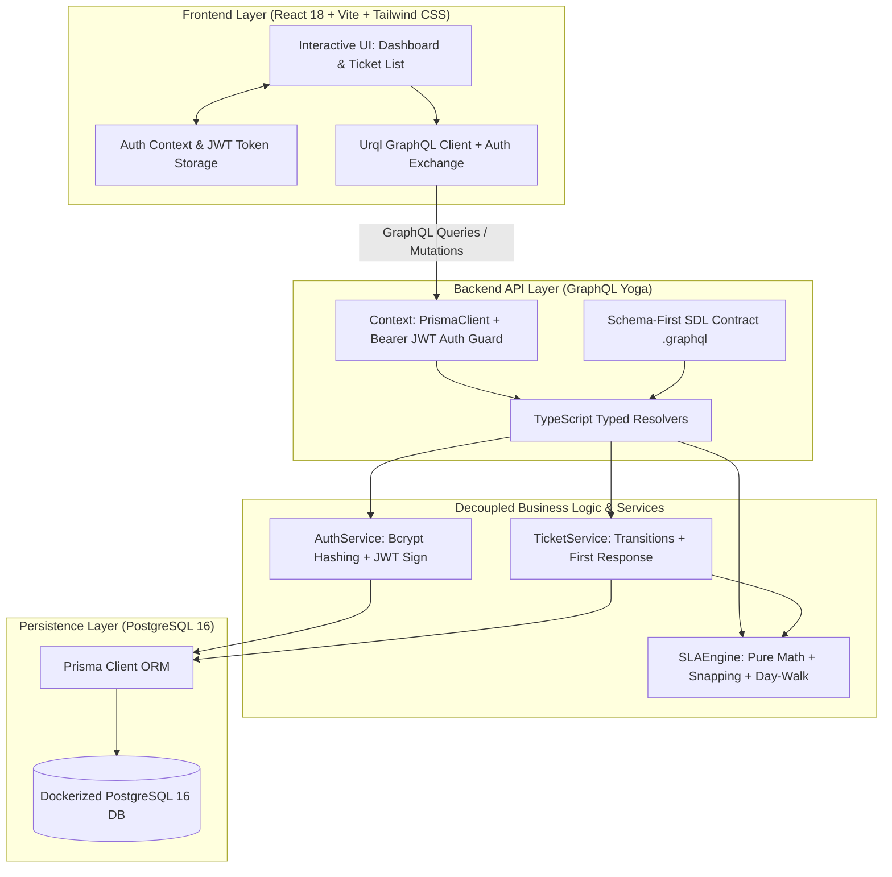
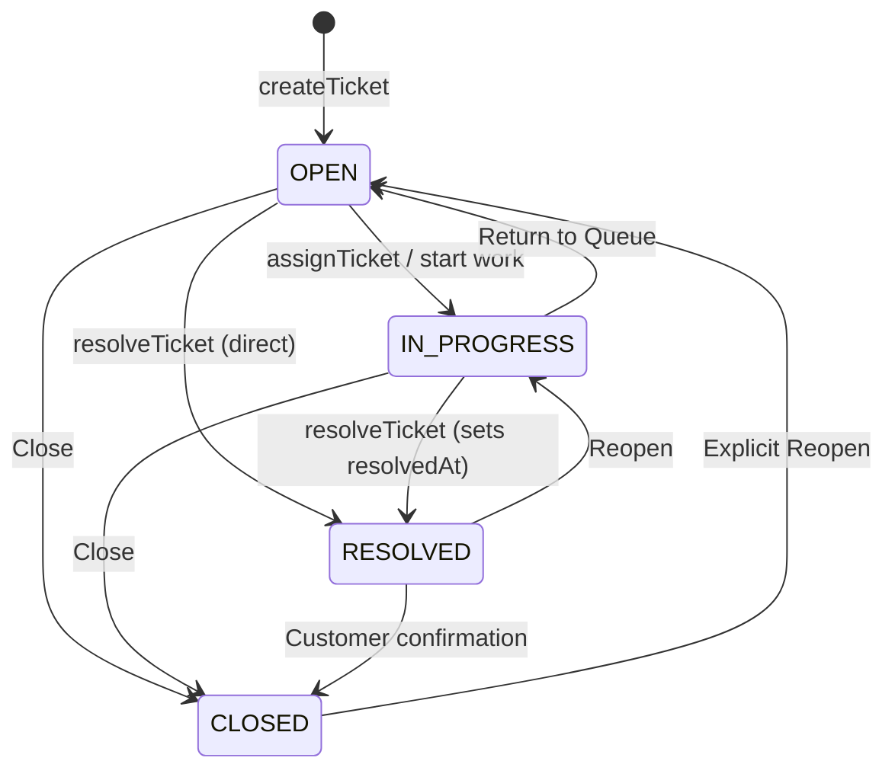

# 🧭 Support Ticket & SLA Tracker — Project Walkthrough & Architecture Review

This document provides a comprehensive technical walkthrough of the **Support Ticket & SLA Tracker** application for reviewers, covering architecture, SLA mathematics, database design, API design, testing, and operational tradeoffs.

---

## 1. Executive Summary & Objective

The goal of this application is to solve the classic enterprise challenge of tracking support tickets against strict **business-hours-only Service Level Agreements (SLAs)**.

### Core SLA Rules:
- **Business Schedule**: Monday through Friday, 09:00 to 18:00 (9 business hours = 540 business minutes per day).
- **Exclusions**: Weekend days (Saturday & Sunday), outside-hours periods (nights), and configured public holidays never count against an SLA budget.
- **Timezone**: Normalized to a configured business timezone (`BUSINESS_TIMEZONE=Asia/Kolkata`) and stored in UTC.
- **Clock Freezing**: When an SLA milestone occurs (first comment by a non-reporter for `firstResponseAt`, or ticket resolution for `resolvedAt`), the SLA clock freezes permanently and can never retroactively breach.
- **Single Source of Truth**: The GraphQL API calculates all SLA due dates, remaining business minutes, and states (`ON_TRACK`, `AT_RISK`, `BREACHED`). The frontend strictly renders what the backend returns.

---

## 2. Architecture & Design Patterns



### Architectural Highlights:
1. **Schema-First GraphQL Design**: Defined in `.graphql` SDL files. `@graphql-codegen` compiles these schemas into typed TypeScript resolver interfaces, completely eliminating `any`.
2. **Pure, Isolated SLA Engine**: The business-hours arithmetic is 100% decoupled from Prisma, HTTP, and GraphQL resolvers. It is pure functional TypeScript accepting timestamps, holiday lists, and policy configurations.
3. **Defense-in-Depth Authorization**: Handled entirely on the server using typed guards (`requireAuth`, `requireAgent`) mapping to explicit GraphQL error codes (`UNAUTHORIZED`, `FORBIDDEN`).

---

## 3. SLA Mathematical Engine & Algorithm

### Policy Matrix:
| Priority | First Response SLA | Resolution SLA |
|---|---|---|
| **URGENT** | 1 business hour (60 mins) | 4 business hours (240 mins) |
| **HIGH** | 4 business hours (240 mins) | 24 business hours (1,440 mins) |
| **MEDIUM** | 8 business hours (480 mins) | 48 business hours (2,880 mins) |
| **LOW** | 24 business hours (1,440 mins) | 72 business hours (4,320 mins) |

### Business Time Arithmetic (`addBusinessMinutes`):
```
function addBusinessMinutes(startUtcDate, minutesNeeded, holidays, config):
  zonedCursor = snapToNextBusinessMoment(startUtcDate, holidays, config)
  while minutesNeeded > 0:
    endOfWork = 18:00 on zonedCursor day
    availableToday = minutes between zonedCursor and endOfWork
    if availableToday >= minutesNeeded:
      return fromZonedTime(zonedCursor + minutesNeeded, config.timeZone)
    minutesNeeded -= availableToday
    advance zonedCursor to start of next day (09:00) and snap to next valid business day
```

### Edge Case Snapping (`snapToNextBusinessMoment`):
- **Before Hours** (e.g., Mon 07:00) $\to$ Snaps to Mon 09:00.
- **After Hours** (e.g., Mon 20:00) $\to$ Snaps to Tue 09:00.
- **Friday Evening** (e.g., Fri 17:59) $\to$ 1 minute counts on Friday, remainder continues Mon 09:00.
- **Weekends** (e.g., Sat 14:00) $\to$ Snaps to Mon 09:00.
- **Public Holidays** (e.g., Mon 08-31 is holiday) $\to$ Snaps to Tue 09:00.

### SLA States & The 75% Boundary Rule:
- $\text{Consumed Ratio} = \frac{\text{Elapsed Business Minutes}}{\text{Total SLA Budget Minutes}}$
- **`ON_TRACK`**: $0\% \le \text{Ratio} \le 75.0\%$
- **`AT_RISK`**: $\text{Ratio} > 75.0\%$ and $\text{now} \le \text{dueAt}$
- **`BREACHED`**: $\text{now} > \text{dueAt}$ without milestone completion, or completed after deadline.

---

## 4. Ticket Status Lifecycle & Transitions



| Source Status | Allowed Target Statuses | Disallowed Statuses |
|---|---|---|
| `OPEN` | `IN_PROGRESS`, `RESOLVED`, `CLOSED` | — |
| `IN_PROGRESS` | `OPEN`, `RESOLVED`, `CLOSED` | — |
| `RESOLVED` | `IN_PROGRESS` (Reopen), `CLOSED` | `OPEN` |
| `CLOSED` | `OPEN` (Reopen) | `IN_PROGRESS`, `RESOLVED` |

---

## 5. Testing Strategy

The test suite contains **52 automated tests** across unit and integration suites:

1. **SLA Business Hours Unit Tests (`businessHours.test.ts`)**:
   - Tests normal weekday within-hours arithmetic.
   - Tests before-hours snapping (Mon 07:00 $\to$ 09:00).
   - Tests after-hours snapping (Mon 20:00 $\to$ Tue 09:00).
   - Tests Friday evening edge case (17:59).
   - Tests weekend ticket creation (Sat/Sun).
   - Tests public holiday skipping and consecutive holiday spans.
   - Tests multi-day spans (4h, 8h, 24h, 48h, 72h).

2. **SLA State & Clock Freezing Unit Tests (`slaEngine.test.ts`)**:
   - Validates exact 75% boundary transition to `AT_RISK`.
   - Validates transition to `BREACHED`.
   - Validates permanent clock freezing for `firstResponseAt` and `resolvedAt`.

3. **Authentication & Authorization Unit Tests (`auth.test.ts`)**:
   - Validates bcrypt password hashing and comparison.
   - Validates JWT signing, expiration, and verification.
   - Validates `requireAuth` and `requireAgent` guards throwing `UNAUTHORIZED` and `FORBIDDEN`.

4. **Status Transitions Unit Tests (`ticketService.test.ts`)**:
   - Validates all valid transition paths.
   - Rejects invalid transitions with `INVALID_STATUS_TRANSITION`.

5. **PostgreSQL Real Integration Tests (`ticketFlow.integration.test.ts`)**:
   - Runs directly against PostgreSQL in Docker.
   - End-to-end flow: User registration $\to$ Ticket creation $\to$ Reporter commenting (no first response trigger) $\to$ Agent commenting (triggers and persists `firstResponseAt`) $\to$ Subsequent comments $\to$ Assignment $\to$ Status transition $\to$ Resolution with clock freezing.

---

## 6. How to Run Locally

### 1. Start Database & Install Dependencies
```bash
docker compose up -d
bun install
```

### 2. Apply Migrations & Seed Data
```bash
bun run gendb
bun run seed
```

### 3. Run Tests
```bash
# Run all unit and integration tests
npm run test

# Run unit tests only
npm run test:unit

# Run integration tests against PostgreSQL
npm run test:integration
```

### 4. Run Application
```bash
# Starts backend (http://localhost:4000/graphql) and frontend (http://localhost:3000)
npm run dev:all
```

---

## 7. Tradeoffs & Future Extensions

1. **SLA Pause on `WAITING_ON_CUSTOMER`**:
   - *Current Design*: SLA runs continuously across business hours until resolved.
   - *Extension*: Introduce `WAITING_ON_CUSTOMER` status, compute total business minutes spent in that state, and dynamically extend due dates.
2. **Per-Team Business Calendars**:
   - *Current Design*: Single global business calendar (`Asia/Kolkata`, 09:00–18:00).
   - *Extension*: Add `SupportTeam` model with localized timezones and shift hours (e.g., 24/7 for Tier 3, 8x5 for Tier 1).
3. **Escalation & Webhooks**:
   - Trigger automated notifications to Slack/PagerDuty when a ticket reaches `AT_RISK` (>75% budget consumed).
4. **Audit Trail**:
   - Historical event store recording all assignee changes, priority alterations, and status transitions with actor timestamps.
