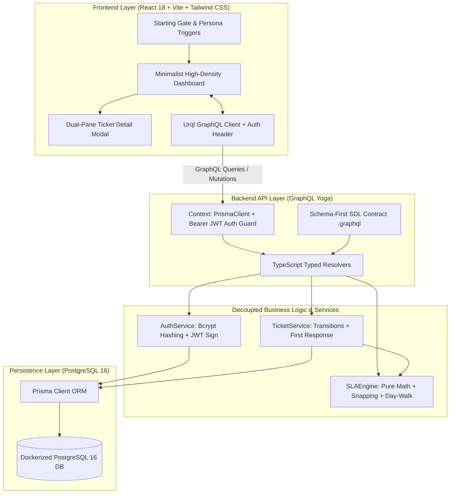

# 🧭 Support Ticket & SLA Tracker — Project Walkthrough & Architecture Review

This document provides a comprehensive technical walkthrough of the **Support Ticket & SLA Tracker** application for reviewers, covering architecture, SLA mathematics, database design, API design, testing, UI design, and operational tradeoffs.

> 🌐 **Live Cloud Backend**: `https://support-ticket-tracker-sla.onrender.com/graphql`  
> 📖 **Cloud Deployment Guide**: [`DEPLOYMENT.md`](./DEPLOYMENT.md)

---

## 1. Executive Summary & Objective

The goal of this application is to solve the classic enterprise challenge of tracking support tickets against strict **business-hours-only Service Level Agreements (SLAs)**.

### Core SLA Rules:
- **Business Schedule**: Monday through Friday, 09:00 to 18:00 (9 business hours = 540 business minutes per day).
- **Exclusions**: Weekend days (Saturday & Sunday), outside-hours periods (nights), and configured public holidays never count against an SLA budget.
- **Timezone**: Normalized to a configured business timezone (`BUSINESS_TIMEZONE=Asia/Kolkata`) and stored in UTC.
- **Clock Freezing**: When an SLA milestone occurs (first comment by a non-reporter for `firstResponseAt`, or ticket resolution for `resolvedAt`), the SLA clock freezes permanently and can never retroactively breach.
- **Single Source of Truth**: The GraphQL API calculates all SLA due dates, remaining business minutes, and states (`ON_TRACK`, `AT_RISK`, `BREACHED`). The frontend strictly renders what the backend returns.

---

## 2. Architecture & Design Patterns



### Architectural Highlights:
1. **Schema-First GraphQL Design**: Defined in `.graphql` SDL files. `@graphql-codegen` compiles these schemas into typed TypeScript resolver interfaces, completely eliminating `any`.
2. **Pure, Isolated SLA Engine**: The business-hours arithmetic is 100% decoupled from Prisma, HTTP, and GraphQL resolvers. It is pure functional TypeScript accepting timestamps, holiday lists, and policy configurations.
3. **Defense-in-Depth Authorization**: Handled entirely on the server using typed guards (`requireAuth`, `requireAgent`) mapping to explicit GraphQL error codes (`UNAUTHORIZED`, `FORBIDDEN`).
4. **Modern Minimalist UI**: Tailored to match clean high-density SaaS interfaces (Linear/Vercel) with custom SVG progress rings, outline priority/status pill badges, and dual-pane modal views.

---

## 3. SLA Mathematical Engine & Algorithm

### Policy Matrix:
| Priority | First Response SLA | Resolution SLA | Total Business Minutes |
|---|---|---|---|
| **URGENT** | 1 business hour (60 mins) | 4 business hours (240 mins) | 60m response / 240m resolution |
| **HIGH** | 4 business hours (240 mins) | 24 business hours (1,440 mins) | 240m response / 1,440m resolution |
| **MEDIUM** | 8 business hours (480 mins) | 48 business hours (2,880 mins) | 480m response / 2,880m resolution |
| **LOW** | 24 business hours (1,440 mins) | 72 business hours (4,320 mins) | 1,440m response / 4,320m resolution |

### Business Time Arithmetic (`addBusinessMinutes`):
```typescript
function addBusinessMinutes(startUtcDate, minutesNeeded, holidays, config):
  zonedCursor = snapToNextBusinessMoment(startUtcDate, holidays, config)
  while minutesNeeded > 0:
    endOfWork = 18:00 on zonedCursor day
    availableToday = minutes between zonedCursor and endOfWork
    if availableToday >= minutesNeeded:
      return fromZonedTime(zonedCursor + minutesNeeded, config.timeZone)
    minutesNeeded -= availableToday
    advance zonedCursor to start of next day (09:00) and snap to next valid business day
```

### Edge Case Snapping (`snapToNextBusinessMoment`):
- **Before Hours** (e.g., Mon 07:00) $\to$ Snaps to Mon 09:00.
- **After Hours** (e.g., Mon 20:00) $\to$ Snaps to Tue 09:00.
- **Friday Evening** (e.g., Fri 17:59) $\to$ 1 minute counts on Friday, remainder continues Mon 09:00.
- **Weekends** (e.g., Sat 14:00) $\to$ Snaps to Mon 09:00.
- **Public Holidays** (e.g., Mon 08-31 is holiday) $\to$ Snaps to Tue 09:00.

### SLA States & The 75% Boundary Rule:
- $\text{Consumed Ratio} = \frac{\text{Elapsed Business Minutes}}{\text{Total SLA Budget Minutes}}$
- **`ON_TRACK`**: $0\% \le \text{Ratio} \le 75.0\%$
- **`AT_RISK`**: $\text{Ratio} > 75.0\%$ (and not completed late)
- **`BREACHED`**: Elapsed time exceeds budget before completion, or milestone timestamp is after deadline.

---

## 4. Key End-to-End Workflows

### 1. Ticket Creation & Due Date Projection
1. Reporter creates an `URGENT` ticket on Friday at 17:00 UTC.
2. Backend snaps time to `Asia/Kolkata`, calculates 60 minutes for First Response and 240 minutes for Resolution.
3. Because the work day ends at 18:00, the remaining resolution budget rolls into Monday 09:00 with zero penalty over the weekend.

### 2. First Response Milestone & Clock Freeze
1. Support agent posts the first comment on the ticket (`authorId !== reporterId`).
2. `TicketService.addComment` checks if `ticket.firstResponseAt` is `null`.
3. If `null`, it atomically stamps `ticket.firstResponseAt = new Date()`.
4. From that millisecond onward, `calculateSLAState` returns the frozen outcome (e.g. `ON_TRACK`) and remaining minutes is permanently locked to `0`.

### 3. Resolution & Ticket Lifecycle
1. Support agent reviews ticket and transitions status to `RESOLVED`.
2. Backend atomically stamps `ticket.resolvedAt = new Date()`.
3. Resolution SLA clock freezes permanently.

---

## 5. User Interface Architecture

- **Starting / Landing Page**: Introduces SLA rules and features 1-click persona quick-launch buttons for `Alex Agent` (`agent@example.com`) and `Rachel Reporter` (`reporter@example.com`).
- **Main Dashboard**:
  - Live subheader with `● Engine Active`, `🌐 Asia/Kolkata`, and `📅 Holidays Loaded` chips.
  - 4 Metric counter cards with colored status dots.
  - Real-time search and filter bar (`Status`, `Priority`, `SLA State`, `Assignee`).
  - High-density data table with circular SVG progress rings.
- **Dual-Pane Detail Modal**:
  - Left: Description, comment stream with green First Response Milestone box (`🎯 1st Response SLA Milestone (Clock Frozen)`), and inline reply box with black Send button.
  - Right: Circular SVG SLA countdown cards, metadata card, and Agent Action Center (`Reassign Ticket ▾`, segmented status toggle `[ OPEN | PROG | RESOLVED ]`, and `Resolve Ticket` button).

---

## 6. Testing Strategy & Verification

### Automated Test Suite: **52 / 52 Passed (100%)**
```bash
bun run --cwd backend test
```
- **15 Business Hours Math Tests**: Snapping, holiday skips, weekend boundary math.
- **12 SLA Engine Unit Tests**: 75% boundary transitions, milestone freezes, overdue breaches.
- **9 Ticket Service Tests**: State transitions, non-reporter first reply detection.
- **7 Auth Unit Tests**: Bcrypt hashing, token issuance, role guards.
- **8 PostgreSQL Integration Tests**: Full database integration test against Docker PostgreSQL container.
